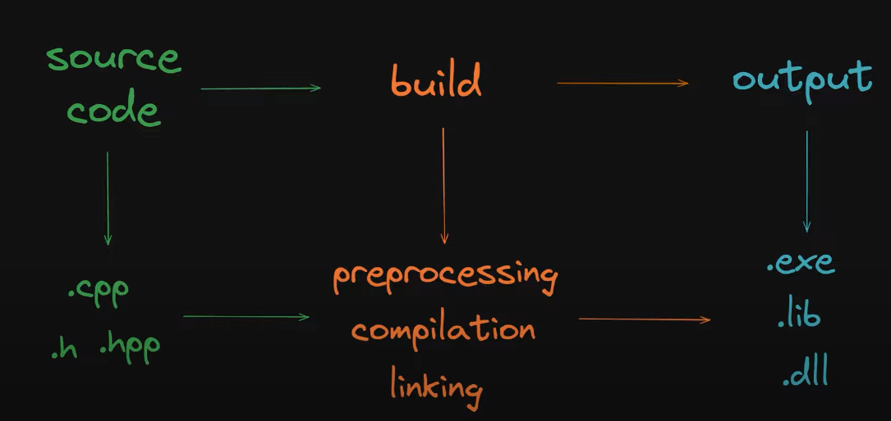
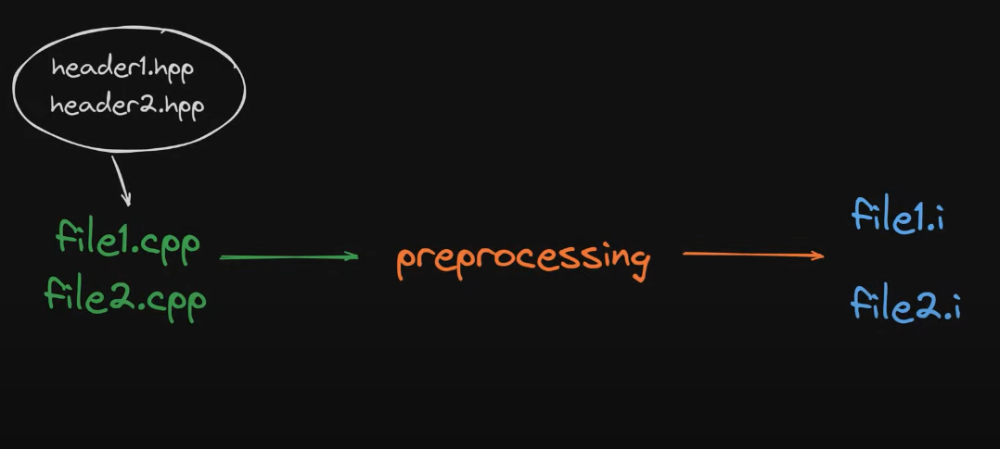
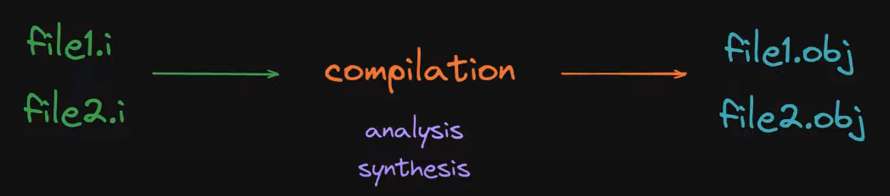
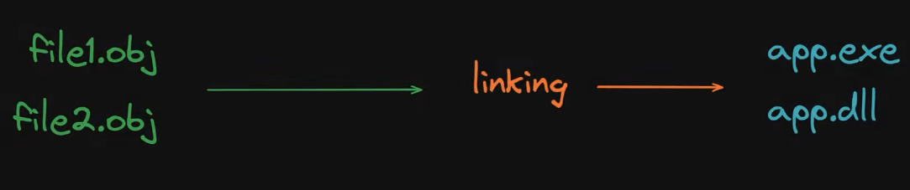
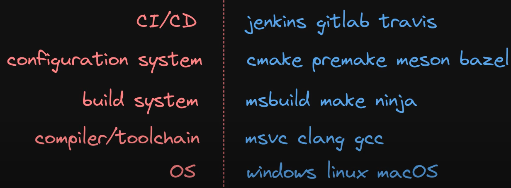

# C++ Learn

Study notes on **how a C++ program is built** (preprocessing, compilation, linking and the tools around them), together with a small C++20 sample project that exercises the build system: a two-hero console fight game, a shared math library and CI builds on Linux and Windows.

## Contents

- [Installation](#installation)
- [Base steps](#base-steps)
- [Build steps](#build-steps)
- [Preprocessing](#preprocessing)
- [Compilation](#compilation)
- [Linking](#linking)
- [Build speed-ups and libraries](#build-speed-ups-and-libraries)
- [Build tools](#build-tools)
- [Sample project](#sample-project)
- [License](#license)

## Installation

1. Install Conan and a C++ compiler.
2. Install `gdb` for debugging.
3. Run `./scripts/conan_build.sh` to install dependencies.
4. Run `./scripts/build.sh` to configure and build.

## Base steps

| source code | build | output |
|----------- | ----------- | ----------- |
| .cpp .h .hpp .cxx (C++23 modules) | `preprocessing` -> `compilation` -> `linking` | .exe .lib .dll |

---

## Build steps

| preprocessing | compilation | linking |
|----------- | ----------- | ----------- |
| Removes comments, expands macros and inserts the included files (plain copy-paste). | (`analysis` (front-end) -> `synthesis` (back-end)) Translates code to machine code. | Links all libraries. |

## Preprocessing

## Compilation

### `Analysis` (front-end)

1. Lexical analysis (`lexemes` -> `tokens`)
2. Syntax analysis (`Abstract syntax tree (AST)` -> `symbol table`)
3. Semantic analysis (type checking)

### `Synthesis` (back-end)

1. Intermediate code generation (Intermediate Representation (IR) -> Three-address code (TAC) -> Static Single Assignment (SSA))
2. `Optimization` (MSVC flags: `/Od` disabled; `/O1` minimum size; `/O2` maximum speed)
3. Target code generation -> `.obj`

##### `Optimization`

1. Common optimizations
2. Function inlining (`inline`)
3. `constexpr`
4. Data structure alignment (memory layout)

## Linking

1. `ODR`: the one definition rule

## Build speed-ups and libraries

1. Precompiled header files (PCH)
2. Include-What-You-Use (IWYU)
3. `/MP` (MSVC: build with multiple processes)
4. Unity (JUMBO) build
5. Static libraries
6. Dynamic libraries

## Build tools

## Sample project

`FightClubGame` is a small console game used as a build target: two heroes attack each other in turns until one wins or both run out of bullets.

| Path | What it is |
|---|---|
| `src/main.cpp` | Game loop |
| `src/game/` | `Character` and `Weapon` classes (`DLL_GAME_SOURCES` in `CMakeLists.txt`) |
| `src/utils/` | `Math`, a small library with export macros for Windows DLLs |
| `src/pch.hpp` | Precompiled header |
| `scripts/` | `conan_build.sh` (dependencies), `build.sh` (build), `fresh.sh` (clean rebuild) |
| `.github/workflows/` | Linux and Windows builds on push and pull requests to `development` |
| `.clang-format` | Code style |

## License

Released under the [MIT License](LICENSE).
